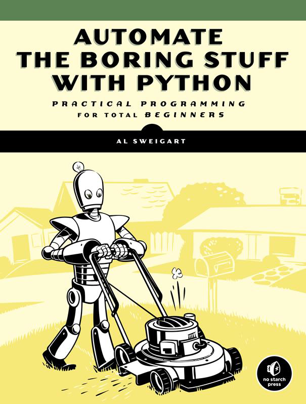

# Une approche du Test automatique conduite par le contexte

> A Context-Driven Approach to Automation in Testing

de James Bach et Michael Bolton

-------------------
### NDT : 
  Ce document est une "tentative" de traduction de l'article "[A Context-Driven Approach to Automation in Testing](http://www.satisfice.com/articles/cdt-automation.pdf)".
  C'est un travail actuellement toujours en cours.
  
  Traduit avec l'aimable autorisation de James Bach et Mickael Bolton.

-------------------

# Avant-propos

Les outils peuvent être utilisés de manières formidables pour aider au test des logiciels. Cependant, dans toute l'industrie, on voit  des outils mal utilisés. Ceci engendre un grand gaspillage, de la confusion et des difficultés à ce qui est déjà un problème difficile à résoudre. Pourquoi est-ce ainsi ? Que pouvons-nous faire ? Nous pensons que la base du problème vient d'une approche superficielle, restrictive et ritualiste de l'usage des outils. Ce fait est encouragé par la croyance généralisée mais rarement examinée et absolument fausse que le test est un processus mécanique et répétitif. Faire du "bon" test, tout comme programmer, est en réalité un défi intellectuel. L'usage d'outils en test doit absolument être réalisé par des personnes qui comprennent la complexité des outils et des tests. Ceci est vrai pour le test comme pour le développement, mais en réalité pour toutes activités demandant des compétences spécifiques, de la menuiserie à la médecine.

> There are many wonderful ways tools can be used to help software testing. Yet, all across
industry, tools are poorly applied, which adds terrible waste, confusion, and pain to what is
already a hard problem. Why is this so? What can be done? We think the basic problem is a
shallow, narrow, and ritualistic approach to tool use. This is encouraged by the pandemic,
rarely examined, and absolutely false belief that testing is a mechanical, repetitive process.
Good testing, like programming, is instead a challenging intellectual process. Tool use in
testing must therefore be mediated by people who understand the complexities of tools and
of tests. This is as true for testing as for development, or indeed as it is for any skilled
occupation from carpentry to medicine.

------------------------------

# Introduction

Dans ce "livre blanc", nous proposons une vision du test automatique qui place le testeur au centre du test, tout en promouvant une manière de penser qui fait la part belle aux nombreuses choses que les outils peuvent faire pour nous. Nous adoptons volontier les outils sans renoncer à notre responsabilité en tant que technicien de garder la main. 

Les outils peuvent être puissants, et nous allons dire des choses encourageantes et utiles sur leur compte. Mais l'automatisation peut aussi être traître - ne serait-ce qu'à cause du terme "automatisation" qui peut vouloir dire différentes choses. Donc nous devons commencer avec un regard lucide sur les idées fausses qui engendrent un grand gaspillage, de la confusion et des difficultés à ce qui est déjà un problème difficile à résoudre, même dans le meilleur des cas. Si vous avez besoin de bien tester, alors une bonne maitrise de l'outillage fera partie du travail, et cela signifie que vous devez apprendre pourquoi il est possiible d'aller dans le mauvais sens en utilisant des outils.

> In this white paper, we offer a vision of test automation that puts the tester at the center of testing,
while promoting a way of thinking that celebrates the many things tools can do for us. We
embrace tools without abdicating our responsibility as technical people to run the show.

> Tools can be powerful, and we are going to say encouraging and helpful things about them. But
automation can also be treacherous — not least because the label “automation” refers to a mess of
different things. So, we must begin with a sober look at some basic misconceptions that add
terrible waste, confusion, and pain to what is already difficult even in the best of times. If you need
good testing, then good tool support will be part of the picture, and that means you must learn
why we go wrong with tools

# Les Robots ! A l'aide !
> Robots! Help!

Nous pouvons résumer la pensée dominante sur l'automatisation comme "automatiser le test en automatisant l'utilisateur". Nous ne sommes pas en train de dire que des gens ont littéralement dit cela mais c'est ce qu'ils ont exactement essayé de faire. Nous voyons au moins trois grands problèmes ici qui tendent à banaliser le test :

1. Le terme "automatisation" est trompeur. Nous ne pouvons pas automatiser des utilisateurs. Nous automatisons les actions qu'ils font, mais les utilisateurs font bien plus que cela.
2. La vérification des résultats peut être automatisé, mais les testeurs font bien plus que cela.
3. La vérification automatique des résultats est intéressante, mais les outils font bien plus que cela.

> We can summarize the dominant view of test automation as “automate testing by automating the
user.” We are not claiming that people literally say this, merely that they try to do it. We see at
least three big problems here that trivialize testing:
1. The word “automation” is misleading. We cannot
automate users. We automate some actions they
perform, but users do so much more than that.
2. Output checking can be automated, but testers do
so much more than that.
3. Automated output checking is interesting, but
tools do so much more than that.

###### "Figure 1"

L'automatisation est présentée comme une histoire savoureuse et digeste : "remplacer l'humanité désordonnée et complexe par des robots fiables, rapides et efficaces ! Considérons la [Figure 1](images/figure1.png)". Elle résume exactement cette vision impressionnante : "Automatiser les trucs fastidieux". Ok. Qu'est-ce que l'image nous montre ?

> Automation comes with a tasty and digestible story:
replace messy, complex humanity with reliable, fast,
efficient robots! Consider Figure 1. It perfectly
summarizes the impressive vision: “Automate the Boring
Stuff.” Okay. What does the picture show us?

*Elle nous montre une machine qui prétant fonctionner comme un humain*. Le robot est construit comme un humanoïde. Il utilise un outil normalement manipulé par des humains, exactement de la même manière que des humains le feraient, plutôt que par une interface plus adaptée aux robots. Il n'y a aucune description du procédé de programmation du robot ou de son contrôle, ou de sa correction quand il se tromperait. Il n'y a pas d'autres robots en arrière-plan. Le rôle de l'humain dans cette scène n'est pas représenté. Aucun humain apparaît même en arrière-plan. Le message est : les robots remplacent les humains dans des tâches sans intérêt, sans changer la nature du processus, et sans aucune trace de présence humaine, d'une indication, ou d'un but. Est-ce de l'automatisation ? Est-ce comme cela que ça marche ? Non !

> It shows us a machine that is intended to function as a
human. The robot is constructed as a humanoid. It is
using a tool normally operated by humans, in exactly the
way that humans would operate it, rather than through
an interface more suited to robots. There is no depiction of the process of programming the robot
or controlling it, or correcting it when it errs. There are no broken down robots in the background.
The human role in this scene is not depicted. No human appears even in the background. The
message is: robots replace humans in uninteresting tasks without changing the nature of the
process, and without any trace of human presence, guidance, or purpose. Is that what automation
is? Is that how it works? No!

Bien sûr, il s'agit d'un dessin légé à ne pas prendre au sérieux. Mais le problème est que, dans notre parcours dans toute l'industrie, nous voyons des clients penser le véritable test, la véritable automatisation, et les vraies personnes exactement de cette manière caricaturale. Par contre le problème qui en découle est sérieux.

> Of course it is a light-hearted cartoon, not to be taken seriously. The problem is, in our travels all
over the industry, we see clients thinking about real testing, real automation, and real people in
just this cartoonish way. The trouble that comes from that is serious.

Comment ça sérieux ? Notre expérience nous a montré, en regardant les projets depuis les années 80, qu'il apparait normal que l'effort d'automatisation à grande échelle impute la majeure partie des budgets à la détection de bogues triviales et évidentes sur l'interface graphique, en ne prennant pas le temps et l'effort nécessaire à la recherche de problèmes serieux mais subtils - que nous appelons les bogues "graves". En outre, l'approche typique de l'automatisation est comme le personne d'une machine de Rube Goldberg - nageant entre les dépendances et quasi comiquement sujette aux pannes. Ce type d'automatisation devient un peu comme un nouveau membre du projet; comme si c'était une femme de ménage à la "maintenance couteuse", obsessionnelle et compulsive qui ne voudrait pas entrer dans la maison si celle-ci n'est pas déjà impeccable.

> How serious? In the experience of the authors, observing projects going back to the 80’s, we find
that it is normal for large scale automation efforts to lavish the bulk of their budgets in the detection of
trivial and obvious GUI-level bugs, drawing much needed time and effort away from the hunt for
serious but subtle problems—what we call deep bugs. Furthermore, the typical automation approach
has the character of a Rube Goldberg machine— swimming in dependencies and almost comically
prone to breakdown. 1 This sort of automation becomes almost like a new stakeholder on the project; as with some obsessive-compulsive “high maintenance” cleaning lady who won’t even enter the house until it is already spotless. 

> We believe
the effort typically invested in automation would in most cases be better invested directly into
humans interacting with the product in complex and sophisticated ways (which also finds the
shallow bugs) and into less expensive supporting tools that help testers test better.
No one can deny that automation tool sales demos are impressive. What we deny is that people
agree on what “automation” means, what it should be, and that those sales demos translate into
practical value on ordinary projects.

